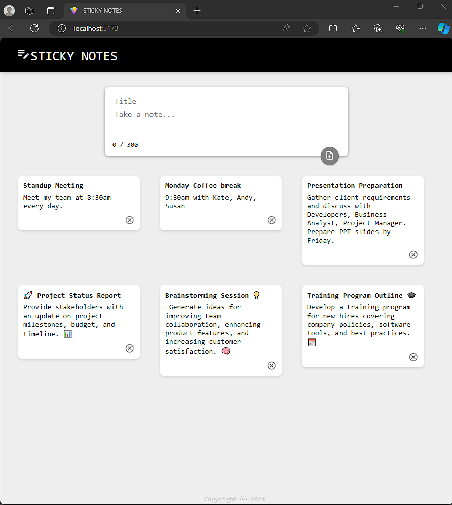

# Sticky Notes

Sticky Notes is an integrated web application for managing notes, built with React for the front end, Node.js for the backend, and PostgreSQL for the database. It allows users to create, view, and delete notes easily.

## Installation

### Frontend Installation

To install and run the front-end React app, please go to https://github.com/yeeman-lab/Sticky_Notes/tree/main/my-react-app

### Backend Installation

To install and run the backend Node.js app, please go to https://github.com/yeeman-lab/Sticky_Notes/tree/main/backend

## Key Features

- **Create Notes**: Easily create new notes by typing a title and content into the input fields.
- **View Notes**: Browse through the list of existing notes to quickly find the information you need.
- **Delete Notes**: Remove unwanted notes by clicking the delete button associated with each note.
- **Responsive Design**: Enjoy a seamless user experience across various devices, including desktops, tablets, and mobile phones.

## Usage

Once both front end and back end applications are running, you can:

- Add a new note by typing a title and content into the input fields and clicking the add button.
- View the list of existing notes.
- Delete a note by clicking the delete button on the note.

## Contributing

Contributions are welcome! If you have any suggestions or improvements, please open an issue or submit a pull request.
